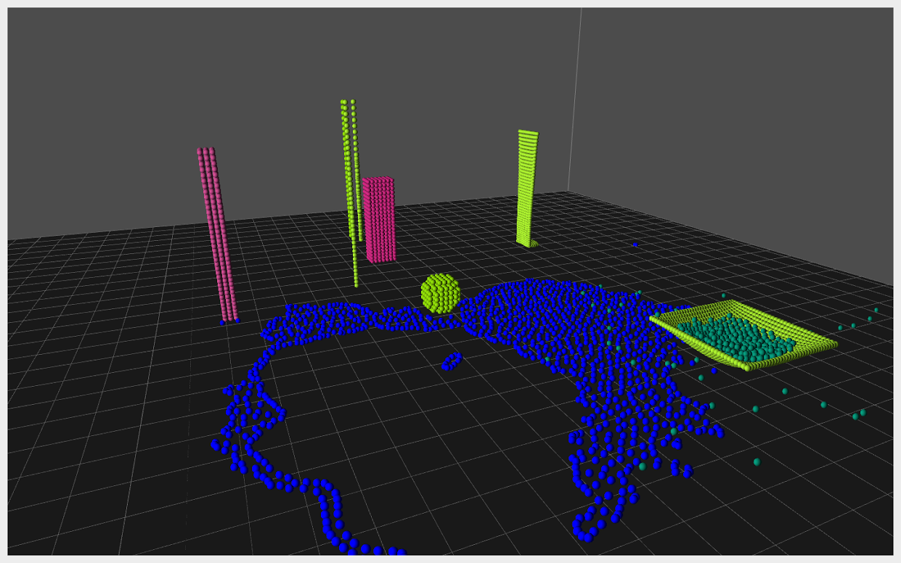
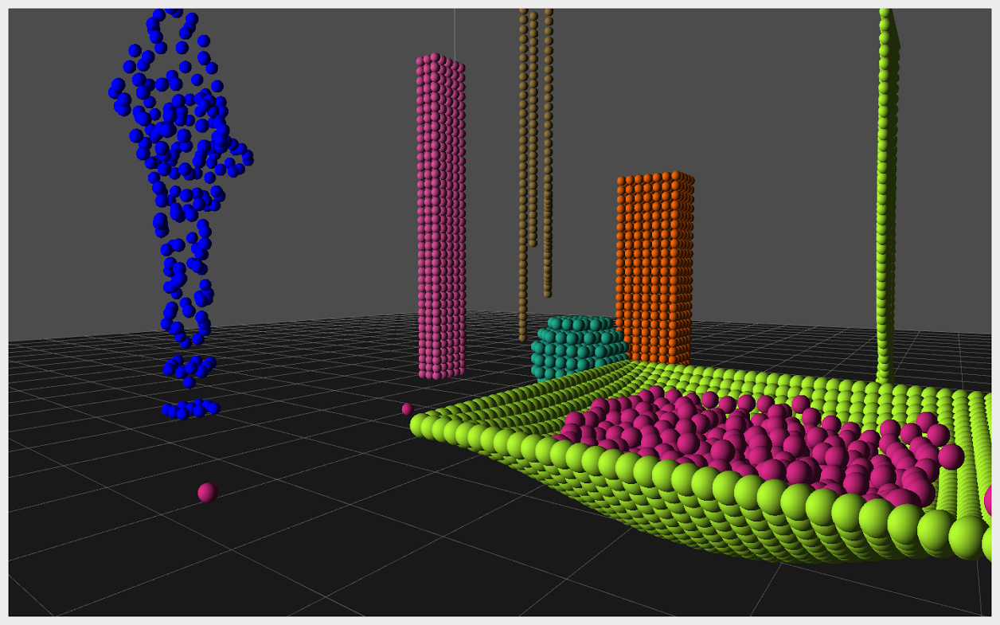
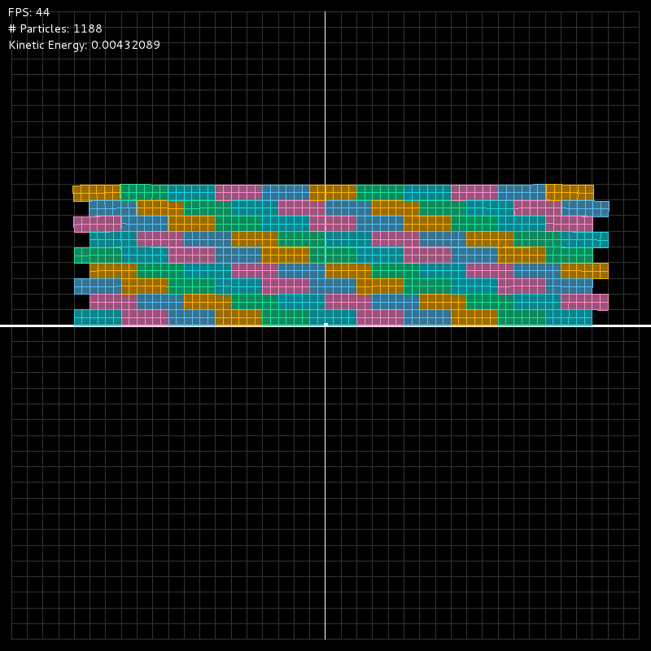
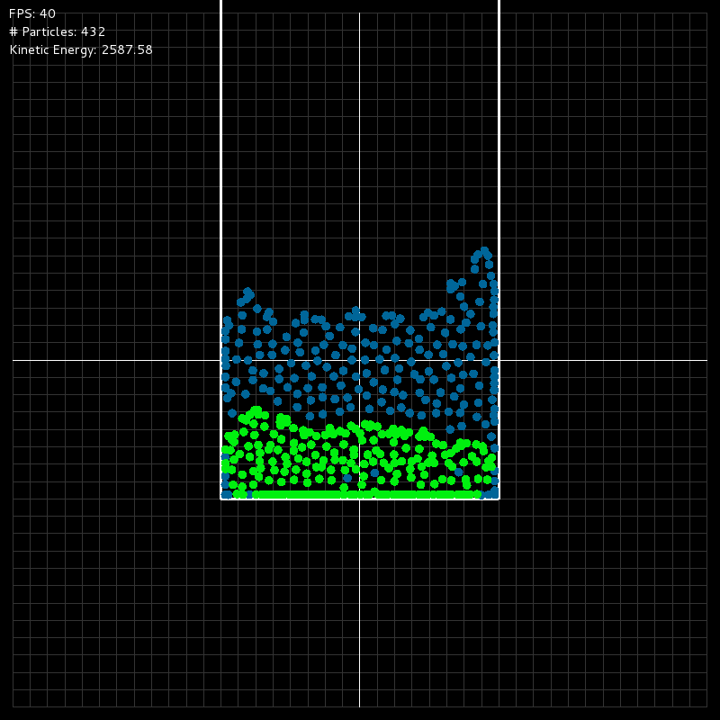

# Unified Particle Solver

#### An implementation of Macklin et. al's [Unified Particle Physics for Real-Time Applications](http://mmacklin.com/uppfrta_preprint.pdf) for both the CPU and GPU.

This physics simulation was implemented on both the CPU (leveraging the Qt framework) and GPU (using CUDA) as a final project for Brown University's graduate-level course CSCI2240: Interactive Computer Graphics by Evan Birenbaum '15, Logan Barnes '15, and Geoff Trousdale '15.

#### Overview
The simulation supports a variety of states of matter by representing the entire world as a large set of small, individual, and independent particles that are influenced by a set of constraints. The system supports the following physical phenomena with two-way interaction:
  - Inter-particle collisions
  - Rigid bodies with approximated stacking
  - Friction
  - Rope and cloth
  - Fluids
  - Gases

#### CPU demo scenes
The following demo scenes are built in the CPU application, labeled with appropriate key commands to bring them up:

  - *1* - A collapsing sand pile demonstrating frictional effect on angle of repose
  - *2* - Stiff stacks of rigid bodies
  - *3* - Stable stacking of rigid bodies in the formation of a wall
  - *4* - Chained rigid bodies acting as a pendulum
  - *5* - A fluid caught and held by a rope
  - *6* - Two fluids settling, demonstrating the Rayleigh-Taylor instability
  - *7* - Solids sinking or floating based on density
  - *8* - Gas particles interacting with a swinging rope
  - *9* - A rigid body being stopped by friction
  - *0* - Fluids trapped like a water balloon
  - *D* - Gas particles emitted into a closed space
  - *S* - Gas particles emitted into an open space
  - *W* - I came in like a wrecking ball!
  - *N* - Newton's cradle
  - *.* - Resolution of interlocked rigid bodies
  - *V* - A volcano erupting and settling

The following commands may also be useful:
  - *T* - Toggle real-time or time-step mode
  - *Space* - move forward by a time step during time-step mode
  - *R* - reset the simulation
  - *C* - toggle rendering of individual particles

#### GPU demo scenes
Note: This version of the program no longer uses the CUDA 7 cuSolver library allowing it to be run on CUDA 5 capable machines.

The following demo scenes are built in the GPU application, labeled with appropriate key commands to bring them up:

  - *1* - A single rope demonstrating basic distance constraints
  - *2* - A cloth created with a grid of distance constraints
  - *3* - Two fluids settling, demonstrating the Rayleigh-Taylor instability
  - *4* - A single stack of solid particles
  - *5* - Multiple stacks of solid particles
  - *6* - A grid of solid particles falling into a cloth net
  - *7* - A giant ball of fluid being fluidy, and demonstrating surface tension
  - *8* - A combo scene of solid particles, cloths, ropes, and an immovable sphere
  - *9* - Hair...just hair
  - *0* - Empty scene

Moving around in the scene:
  - *W* - Move forward
  - *A* - Move left
  - *S* - Move backward
  - *D* - Move right
  - *Mouse* - Look around
  - *Left Click* - Shoot particle into scene
  - *Space* - Add fluid to scene at origin (not guaranteed to maintain stability)

#### Pretty pictures

